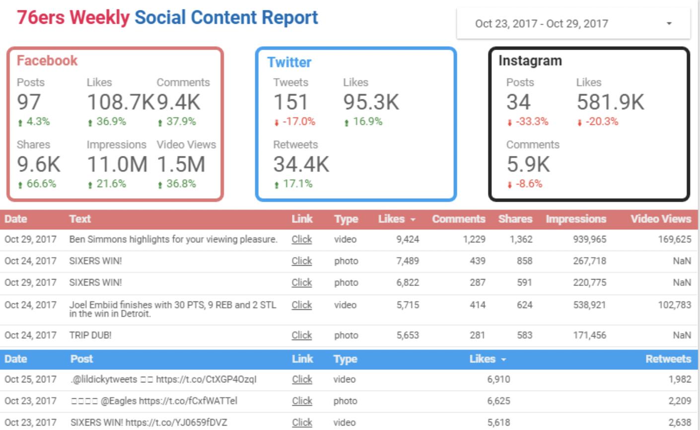

**Disclaimer: This package has been deprecated. Since last time I updated it the social media apis have changed significantly.**

This package enables you to download public post from Facebook, Instagram, and Twitter and upload your data to Google Bigquery.

Refer to the [Example.ipynb](sixopy-test/Example.ipynb) for usage. 

From there you can connect you dashboard tool to the table to build reports. Below is an example of a weekly report using Google Data Studio.

